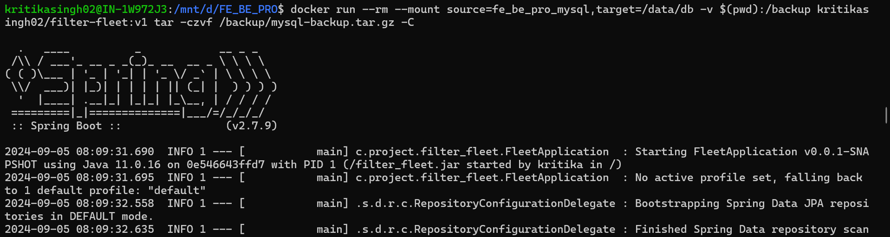
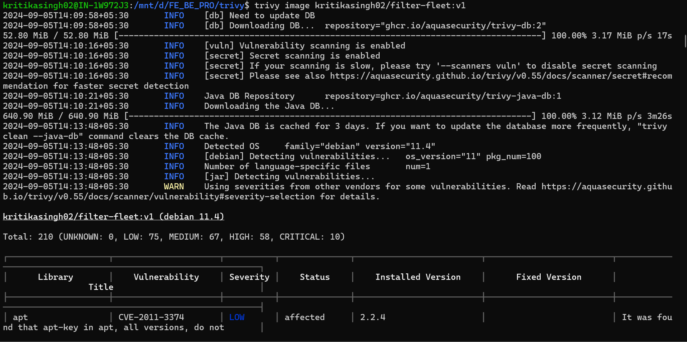
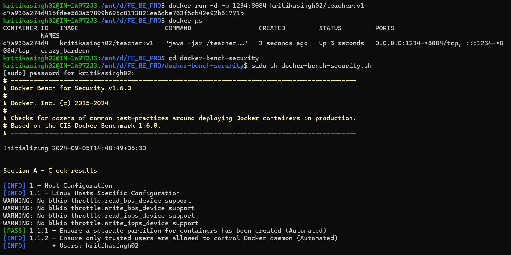
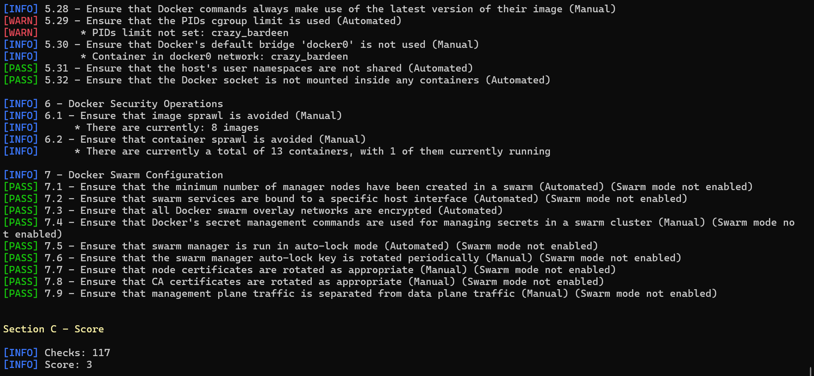

# FILTER FLEET

## Description:
1. Created Backend application for showing list of teams present in Database.
2. Created Docker image with multi stage with not root user.
3. Created docker compose file with volumes, network and mysql database.

4. Docker multi stage image with including user permissions:
   - 
   - 
  
5. Docker Network:
   - 
   - 
   - 
   - 
    
6. Docker Volumns:
   - 
    
7. Backup data from Docker volumes:
   - 
    
8. Restore data from Docker volumes:
   - 
    
9. Docker vulnerability scanning:
   - 
    
10. Docker Bench:
   - 
   - 

## TechStack
1. Java
2. Springboot
3. Docker
4. Docker compose
5. MySQL

## Project StepUp
1. clone git project - git clone https://github.com/kritika-singh-sengar/filter-fleet.git
2. Build Docker image:
    Open terminal: cd filter-fleet
    docker build -t filter-fleet:v1 .
3. Tag Docker image:
    > docker tag student:v1 kritikasingh02/student:v1 docker tag teacher:v1 kritikasingh02/teacher:v1

4. Push Docker image to docker Hub:
    > docker login --username kritikasingh02 
    > docker push kritikasingh02/filter-fleet:v1 docker push kritikasingh02/filter-fleet:v1

## Run Project with Docker compose:
- Open command prompt and run following cmds:
  1. open terminal in main project directory where docker-compose.yml file is present
  2. docker-compose up
- Open postman:
  Get API for student: http://localhot:8082/api/v1/team